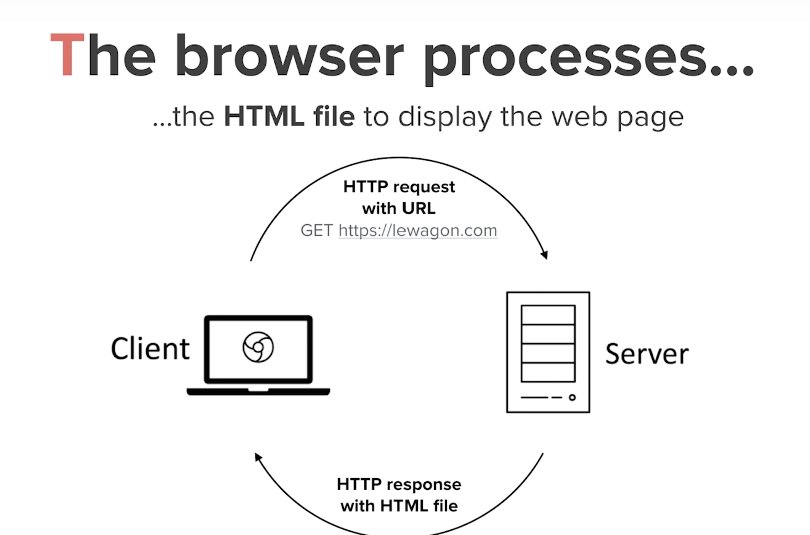

# Web Development 101

# Basics : How does the web work?
Let's start with how the web works. As we've studied in Computer Networks course [(IR.1101)](https://moodle.isep.fr/moodle/course/view.php?id=74), the client (web browser) and the the server communicate with each other through HTTP protocol. When I want to access a page content, I create an HTTP request from my browser to the server hosting the page. The server then replies with an HTTP response, containing the web page content to display.    

Here is how it looks: 
  

# Frontend and Backend : what is the difference?
When we talk about web development, both frontend and backend are involved. Frontend is the code on the client side and backend is the code on the server side. But what does that mean? Well, in a web application (i.e. website), there is content you see and content you don't see but is still important to make the app work. For instance, when you access a web page, everything on your screen is frontend code: titles, images etc. But when you click on a button and it performs an action like rendering a specific content, it's backend code.   

# Frontend code
To write frontend code, the technologies used are HTML, CSS and Javascript.  HTML is a markup language that handles the content of a page. CSS is the styling language that handles the design of the page. Both are very important for every web page but they are not programming languages because you can not use programming concepts like conditionnal statements, loops etc. JavaScript (very different from Java), is a client-side programming language than can be used to add interactive content on your web page like animations. We will cover HTML, CSS and JavaScript later.  

# Backend code
To write backend code, you can use any programming language you want like Java, Python, PHP, Ruby etc. You can even use JavaScript on the server side with [node.js](https://en.wikipedia.org/wiki/Node.js). Your backend code is the one interacting with the database so it can retreive data and display it based on what you want to do.    

When coding a web application, your frontend code and your backend code interact to make everything work. Your frontend will be accessible by anyone. If you want to see the frontend code of a web page in chrome, just press "ctrl + u" on Windows and "command + options + u" on mac os. It can be a great source of inspiration when coding.   

# Does every website has a frontend and a backend ?   
Not necessarily. A website can have only frontend code. It's called a static webpage because you can see the content but you can not interact with it. Think about a small blog with only a few articles and no database. There is no login access, no specific features, just a list of articles that you can read so no need for backend code. If you add backend code to such a website, you could implement additional features like a user session and an "add to favorite" feature to save your favorite articles as a user. 

# Conclusion
When you acces a web page, your client sends a request to the server trough HTTP protocol. Frontend code is what you see. Backend code is what you can't see. 

# Additional resources
To learn more on the topic, consult the following pages: 
* [Comment fonctionnent les sites web](https://openclassrooms.com/fr/courses/1603881-apprenez-a-creer-votre-site-web-avec-html5-et-css3/1604192-decouvrez-le-fonctionnement-des-sites-web) par OpenClassrooms
* [How the web works](https://www.youtube.com/watch?v=hJHvdBlSxug) by Academind
* [What's the difference between frontend and backend?](https://www.pluralsight.com/blog/film-games/whats-difference-front-end-back-end)
* [Frontend Vs. Backend Development – What's The Difference?](https://www.youtube.com/watch?v=eCUeoPp-5do) by CareerFoundry
